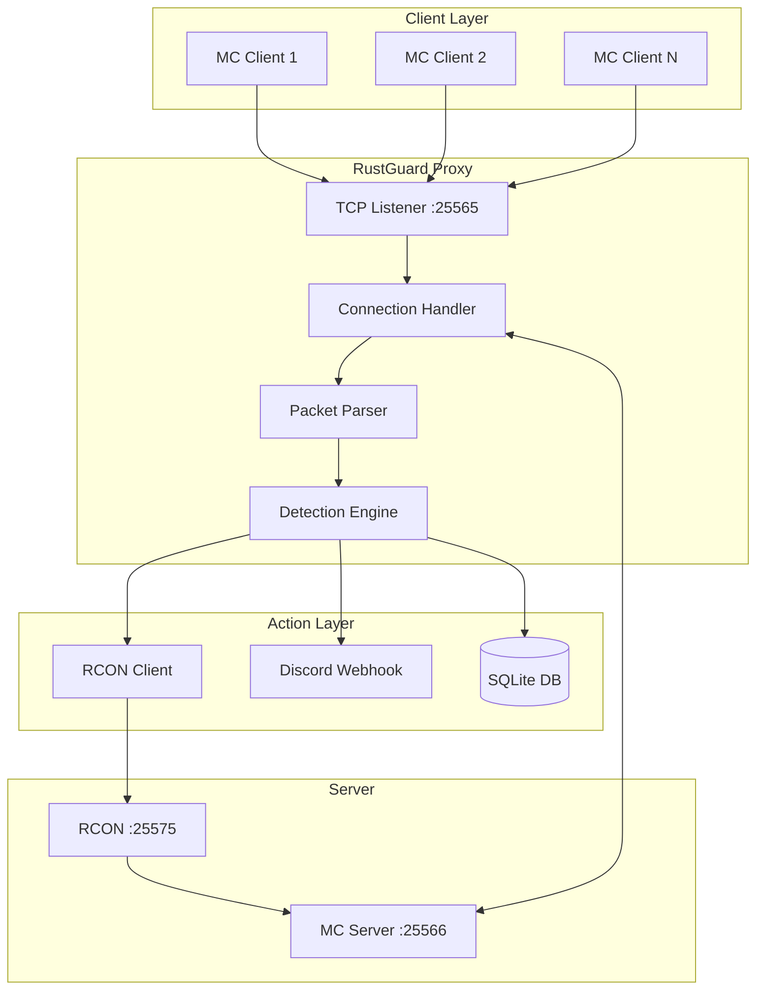
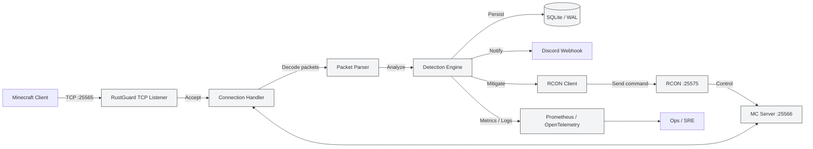
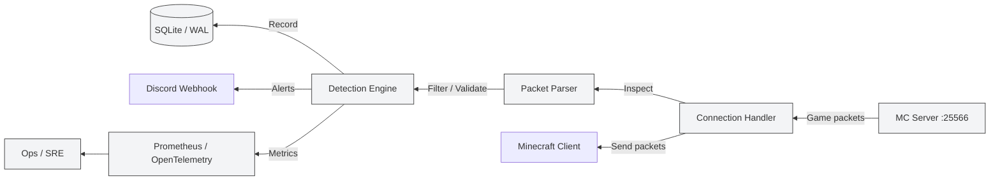

# Architecture Overview

## System Design

RustGuard operates as a transparent TCP proxy between Minecraft clients and the server.

## Core Principles

### 1. Zero Server Impact

* Runs as separate process
* Server never blocked by anti-cheat
* If proxy crashes, server continues

### 2. Transparent Operation

* Players connect normally
* No client modifications needed
* Seamless experience for legitimate players

### 3. Context-Aware Detection

* Understands server plugins
* Accounts for custom items
* Recognizes safe zones
* Prevents false positives

### 4. Performance First

* Async/await with Tokio
* Zero-copy packet handling
* Efficient memory usage
* Scales to thousands of players

## Data Flow

### Inbound (Client → Server)

### Outbound (Server → Client)

