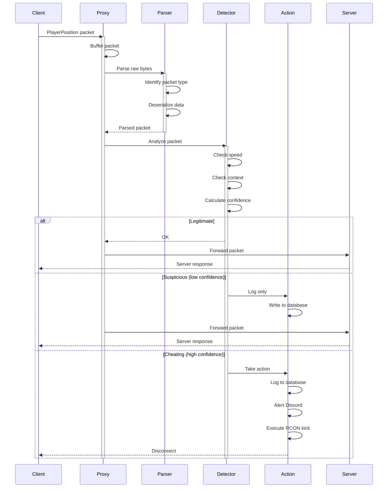

# Packet Flow

## Overview

Understanding how packets move through RustGuard is crucial for debugging and extending functionality.

## Detailed Flow Diagram


## Packet Types

### Critical Packets (Always Analyzed)

| Packet ID | Name | Purpose |
|-----------|------|---------|
| 0x13 | PlayerPosition | Movement detection |
| 0x14 | PlayerPositionAndLook | Movement + rotation |
| 0x15 | PlayerLook | Rotation only |
| 0x2C | PlayerAbilities | Flying status |
| 0x2E | PlayerAction | Breaking blocks |
| 0x2F | UseEntity | Combat detection |

### Monitored Packets

| Packet ID | Name | Use Case |
|-----------|------|----------|
| 0x0F | KeepAlive | Lag detection |
| 0x10 | CustomPayload | Mod detection |
| 0x1A | HeldItemChange | Item tracking |

## Processing Pipeline

### Stage 1: Reception
```rust
// Pseudo-code
let mut buffer = vec![0u8; 4096];
let n = socket.read(&mut buffer).await?;
let packet_data = &buffer[..n];
```

### Stage 2: Parsing
```rust
// Using azalea
let packet = parse_packet(packet_data)?;
match packet {
    Packet::PlayerPosition(pos) => handle_position(pos),
    Packet::UseEntity(attack) => handle_attack(attack),
    _ => forward_packet(packet),
}
```

### Stage 3: Analysis
```rust
fn analyze_position(pos: &Position, state: &PlayerState) -> Verdict {
    let speed = calculate_speed(pos, state.last_pos);
    let context = get_context(state);
    
    if speed > MAX_SPEED && !context.has_speed_effect {
        Verdict::Suspicious(0.95)
    } else {
        Verdict::Clean
    }
}
```

### Stage 4: Action
```rust
match verdict {
    Verdict::Clean => forward_to_server(packet),
    Verdict::Suspicious(conf) if conf < 0.95 => {
        log_detection(player, verdict);
        forward_to_server(packet);
    }
    Verdict::Suspicious(conf) => {
        kick_player(player, "Cheating detected");
        alert_discord(player, verdict);
    }
}
```

## Timing Considerations

### Latency Budget
- Packet receive: ~0.1ms
- Parsing: ~0.2ms
- Analysis: ~0.5ms
- Forwarding: ~0.1ms
- **Total: <1ms added latency**

### Async Benefits

```mermaid
gantt
    title Concurrent Packet Processing
    dateFormat X
    axisFormat %L
    
    section Player 1
    Receive :0, 1
    Parse   :1, 2
    Analyze :2, 5
    Forward :5, 6
    
    section Player 2
    Receive :0, 1
    Parse   :1, 2
    Analyze :2, 4
    Forward :4, 5
    
    section Player 3
    Receive :1, 2
    Parse   :2, 3
    Analyze :3, 6
    Forward :6, 7
```


All players processed concurrently!

## Error Handling

### Invalid Packets
```rust
match parse_packet(data) {
    Ok(packet) => process(packet),
    Err(ParseError::Malformed) => {
        log_warning("Malformed packet from {}", player);
        // Forward anyway (don't break connection)
        forward_raw(data);
    }
    Err(ParseError::UnknownType) => {
        // New packet type we don't handle yet
        forward_raw(data);
    }
}
```

### Connection Loss
```rust
if client.write_all(&packet).await.is_err() {
    cleanup_player_state(player_id);
    update_database(player_id, "disconnected");
    return;
}
```

## Performance Optimization

### Buffer Pooling
```rust
// Reuse buffers instead of allocating
static BUFFER_POOL: Lazy<BufferPool> = Lazy::new(|| {
    BufferPool::new(4096, 1000) // size, count
});
```

### Batch Processing
```rust
// Process multiple packets in batch
let mut batch = Vec::new();
for _ in 0..10 {
    if let Some(packet) = try_recv() {
        batch.push(packet);
    } else {
        break;
    }
}
analyze_batch(&batch);
```

## Debugging

### Enable Packet Logging
```yaml
# config.yaml
logging:
  packets: true
  packet_types: ["PlayerPosition", "UseEntity"]
```

### Trace Specific Player
```rust
if player.username == "DebugPlayer" {
    tracing::debug!(
        "Packet: {:?}, Speed: {:.2}, Context: {:?}",
        packet, speed, context
    );
}
```

## Related Documents
- [[Architecture/Overview]]
- [[Core-Components/Proxy-Layer]]
- [[Core-Components/Detection-Engine]] 