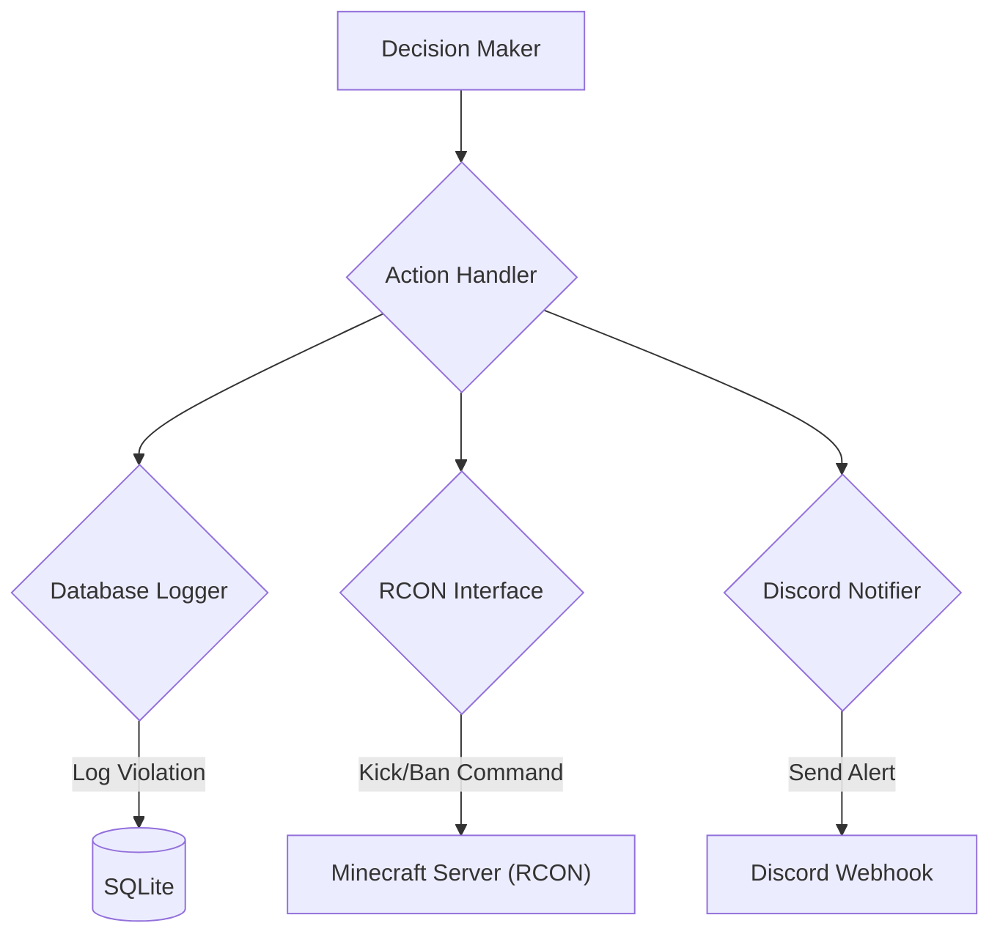

# Action Handler

## Overview

The Action Handler is responsible for executing the final consequence chosen by the Decision Maker in the Detection Engine. It performs three main tasks: **punishment execution** (Kick/Ban), **persistent logging** (Database), and **external notification** (Discord).

## Action Workflow

Once the Detection Engine returns an `Action` (e.g., `Action::Kick`), the handler processes it through the necessary systems asynchronously.




## Action Execution Implementation

The core logic uses `tokio::select!` to await the results of the external communication modules (RCON and Discord), ensuring the primary proxy thread is not blocked.

```rust
// The primary function to execute a decided action
pub async fn handle_action(player: &PlayerState, detection: &Detection, action: Action) -> Result<()> {
    match action {
        Action::Ignore => {
            tracing::debug!("Ignored low-confidence detection: {}", detection.cheat_type);
        },
        Action::Log => {
            self.log_violation(player, detection, "Log only").await?;
        },
        Action::Warn => {
            self.log_violation(player, detection, "Warning issued").await?;
            self.notify_discord(player, detection, "WARN").await;
        },
        Action::Kick => {
            let reason = format!("[RustGuard] Kicked for high-confidence violation: {}", detection.cheat_type);
            
            // Execute RCON command and log simultaneously
            tokio::try_join!(
                self.rcon.execute_command(&format!("kick {} {}", player.username, reason)),
                self.log_violation(player, detection, "Kicked"),
                self.notify_discord(player, detection, "KICK"),
            )?;
        },
        Action::Ban => {
            let reason = format!("[RustGuard] Banned permanently for extreme cheating: {}", detection.cheat_type);
            
            // Execute Ban command and log simultaneously
            tokio::try_join!(
                self.rcon.execute_command(&format!("ban {} {}", player.username, reason)),
                self.log_violation(player, detection, "Banned"),
                self.notify_discord(player, detection, "BAN"),
            )?;
        }
    }
    Ok(())
}

```

## Database Logging (SQLx)

All non-ignored detections are recorded persistently. This history is used to maintain a player's long-term **`trust_score`**.

```rust
// ActionHandler method to log the event
async fn log_violation(&self, player: &PlayerState, detection: &Detection, action: &str) -> sqlx::Result<()> {
    sqlx::query!(
        "INSERT INTO violations (
            uuid, username, cheat_type, confidence, action, details, timestamp
         ) VALUES (?, ?, ?, ?, ?, ?, ?)",
        player.uuid,
        player.username,
        detection.cheat_type,
        detection.confidence,
        action,
        detection.details.to_string(), // Serialize details to JSON string
        detection.timestamp
    )
    .execute(&self.pool)
    .await?;

    // Update player's trust score in the database
    self.update_trust_score(player.uuid, detection.confidence).await
}

```

## Related Documents

[Detection-Engine](./Detection-Engine.md) 
[Integration/RCON-Interface](../04-Integration/RCON-Setup.md) 
[Architecture/Database-Schema](../01-Architecture/Database-Schema.md)
[Integration/Discord-Webhooks](../04-Integration/Discord-Webhooks.md)
