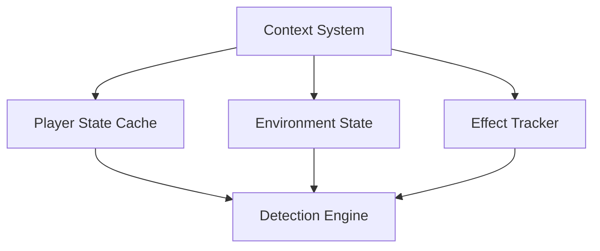

## 🧩 02-Core-Components/Context-System.md

### Descripción General

El **Sistema de Contexto** administra los estados dinámicos de cada jugador (efectos, entorno, equipo, velocidad, etc.) y provee esta información a los detectores para ajustar la sensibilidad de las verificaciones.

### Responsabilidades

- Mantener el historial de estados del jugador.
- Proveer datos confiables y actualizados para los módulos de detección.
- Sincronizar con el servidor (via Proxy Layer).
    

### Datos Almacenados

|Atributo|Tipo|Descripción|
|---|---|---|
|`is_sprinting`|bool|Si el jugador está corriendo|
|`in_water`|bool|Determina si el jugador está en agua|
|`active_effects`|HashMap|Lista de efectos activos (pociones, encantamientos)|
|`last_y_position`|f64|Última posición vertical registrada|
|`timestamp`|i64|Momento del último paquete procesado|