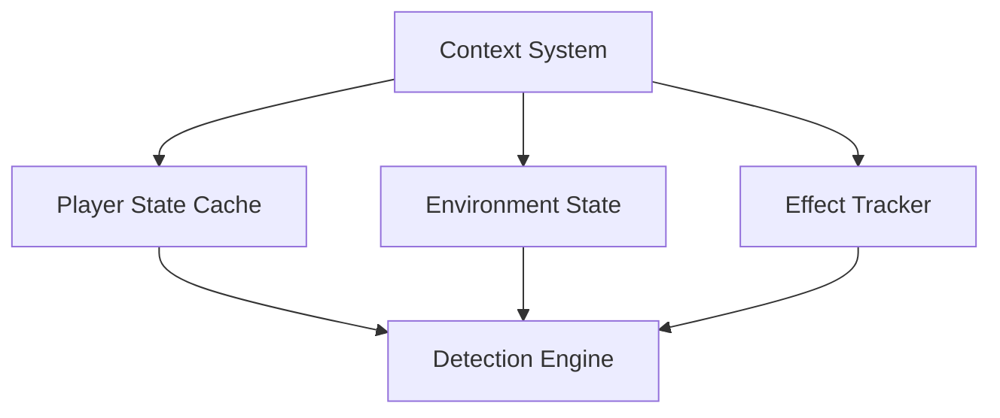

## 🧩 02-Core-Components/Context-System.md

### Overview

The **Context System** manages dynamic player states (effects, environment, equipment, speed, etc.) and provides this information to detection modules to adjust the sensitivity of checks.

### Responsibilities

- Maintain the history of each player's states.
- Provide reliable and up-to-date data for detection modules.
- Synchronize with the server via the Proxy Layer.

### Stored Data

|Attribute|Type|Description|
|---|---|---|
|`is_sprinting`|bool|Whether the player is sprinting|
|`in_water`|bool|Indicates if the player is in water|
|`active_effects`|HashMap|List of active effects (potions, enchantments)|
|`last_y_position`|f64|Last recorded vertical position|
|`timestamp`|i64|Time of the last processed packet|