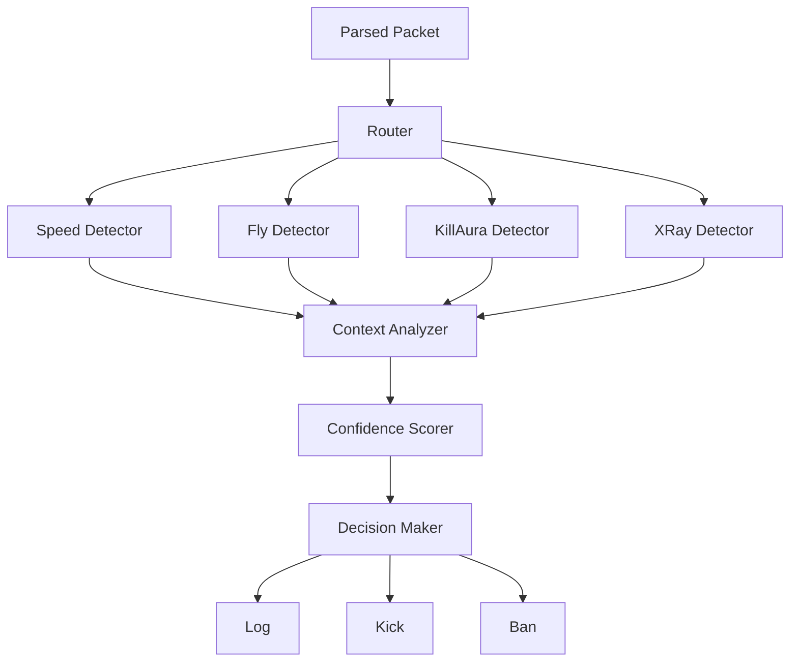

# Detection Engine

## Overview

The detection engine analyzes packet data to identify cheating behavior while minimizing false positives through context awareness.

## Architecture


## Core Components

### 1. Detection Router
```rust
pub struct DetectionEngine {
    speed_detector: SpeedDetector,
    fly_detector: FlyDetector,
    killaura_detector: KillAuraDetector,
    context: Arc<RwLock<ContextSystem>>,
}

impl DetectionEngine {
    pub async fn analyze(&self, packet: &Packet, player: &mut PlayerState) -> Vec<Detection> {
        let mut detections = Vec::new();
        
        match packet {
            Packet::PlayerPosition(pos) => {
                // Speed detection
                if let Some(d) = self.speed_detector.check(player, pos).await {
                    detections.push(d);
                }
                
                // Fly detection
                if let Some(d) = self.fly_detector.check(player, pos).await {
                    detections.push(d);
                }
            }
            
            Packet::UseEntity(attack) => {
                // KillAura detection
                if let Some(d) = self.killaura_detector.check(player, attack).await {
                    detections.push(d);
                }
            }
            
            _ => {}
        }
        
        // Filter through context system
        let context = self.context.read().await;
        detections.retain(|d| {
            context.is_suspicious(player, d)
        });
        
        detections
    }
}
```

### 2. Base Detector Trait
```rust
#[async_trait]
pub trait Detector {
    async fn check(&self, player: &PlayerState, data: &dyn Any) -> Option<Detection>;
    
    fn name(&self) -> &str;
    fn enabled(&self) -> bool;
}

pub struct Detection {
    pub cheat_type: String,
    pub confidence: f64,  // 0.0 - 1.0
    pub details: serde_json::Value,
    pub timestamp: i64,
}
```

### 3. Player State Tracking
```rust
pub struct PlayerState {
    pub username: String,
    pub uuid: String,
    
    // Position history
    pub positions: VecDeque<PositionData>,
    pub max_history: usize,
    
    // Movement state
    pub is_sprinting: bool,
    pub is_sneaking: bool,
    pub on_ground: bool,
    pub in_water: bool,
    pub on_ice: bool,
    
    // Effects
    pub active_effects: HashMap<String, PotionEffect>,
    
    // Combat
    pub last_attack: Option<Instant>,
    pub attack_history: VecDeque<AttackData>,
    
    // Trust
    pub trust_score: f64,
    pub violation_count: u32,
    pub false_positive_count: u32,
    
    // Timing
    pub last_packet: Instant,
    pub packet_frequency: f64,
}

impl PlayerState {
    pub fn update_position(&mut self, pos: PositionData) {
        self.positions.push_back(pos);
        
        if self.positions.len() > self.max_history {
            self.positions.pop_front();
        }
    }
    
    pub fn get_velocity(&self) -> Option<f64> {
        if self.positions.len() < 2 {
            return None;
        }
        
        let current = self.positions.back()?;
        let previous = self.positions.get(self.positions.len() - 2)?;
        
        let distance = current.distance(previous);
        let time_diff = (current.timestamp - previous.timestamp).as_secs_f64();
        
        Some(distance / time_diff)
    }
}
```

## Detection Algorithms

### Speed Detection
```rust
impl SpeedDetector {
    async fn check(&self, player: &PlayerState, pos: &Position) -> Option<Detection> {
        let velocity = player.get_velocity()?;
        let max_allowed = self.calculate_max_speed(player);
        
        if velocity <= max_allowed {
            return None;
        }
        
        // Check if there's a valid reason
        if self.has_valid_reason(player, velocity).await {
            return None;
        }
        
        let overspeed_ratio = velocity / max_allowed;
        let confidence = self.calculate_confidence(overspeed_ratio, player);
        
        Some(Detection {
            cheat_type: "speed_hack".to_string(),
            confidence,
            details: json!({
                "velocity": velocity,
                "max_allowed": max_allowed,
                "ratio": overspeed_ratio,
            }),
            timestamp: Utc::now().timestamp(),
        })
    }
    
    fn calculate_max_speed(&self, player: &PlayerState) -> f64 {
        let mut max = self.config.base_speed;
        
        if player.is_sprinting {
            max *= self.config.sprint_multiplier;
        }
        
        if let Some(speed) = player.active_effects.get("speed") {
            max *= self.potion_multiplier(speed.amplifier);
        }
        
        if player.on_ice {
            max *= self.config.ice_multiplier;
        }
        
        max
    }
}
```

### Fly Detection
```rust
impl FlyDetector {
    async fn check(&self, player: &PlayerState, pos: &Position) -> Option<Detection> {
        // Must have at least 2 positions
        let prev = player.positions.get(player.positions.len() - 2)?;
        
        // Check if going up
        let y_delta = pos.y - prev.y;
        if y_delta <= 0.0 {
            return None;
        }
        
        // Check if on ground
        if player.on_ground {
            return None;
        }
        
        // Calculate max jump height
        let max_jump = self.calculate_max_jump(player);
        
        if y_delta <= max_jump {
            return None;
        }
        
        // Check creative/spectator mode
        if player.is_creative() || player.is_spectator() {
            return None;
        }
        
        let confidence = (y_delta / max_jump - 1.0).min(1.0);
        
        Some(Detection {
            cheat_type: "fly_hack".to_string(),
            confidence,
            details: json!({
                "y_delta": y_delta,
                "max_jump": max_jump,
            }),
            timestamp: Utc::now().timestamp(),
        })
    }
}
```

### KillAura Detection
```rust
impl KillAuraDetector {
    async fn check(&self, player: &PlayerState, attack: &AttackData) -> Option<Detection> {
        player.attack_history.push_back(attack.clone());
        
        // Need history
        if player.attack_history.len() < 5 {
            return None;
        }
        
        // Check for multiple indicators
        let mut suspicious_count = 0;
        
        // 1. Instant rotation
        if self.has_instant_rotation(player) {
            suspicious_count += 1;
        }
        
        // 2. Inhuman timing
        if self.has_perfect_timing(player) {
            suspicious_count += 1;
        }
        
        // 3. Multi-target
        if self.hits_multiple_targets(player) {
            suspicious_count += 1;
        }
        
        // 4. Extended reach
        if attack.distance > self.config.max_reach {
            suspicious_count += 1;
        }
        
        if suspicious_count < 2 {
            return None;
        }
        
        let confidence = suspicious_count as f64 / 4.0;
        
        Some(Detection {
            cheat_type: "killaura".to_string(),
            confidence,
            details: json!({
                "suspicious_indicators": suspicious_count,
                "reach": attack.distance,
            }),
            timestamp: Utc::now().timestamp(),
        })
    }
    
    fn has_instant_rotation(&self, player: &PlayerState) -> bool {
        // Check if head rotated >180° in one tick
        // Implementation...
        false
    }
}
```

## Confidence Scoring
```rust
pub struct ConfidenceScorer {
    base_threshold: f64,
}

impl ConfidenceScorer {
    pub fn calculate(&self, detection: &Detection, player: &PlayerState) -> f64 {
        let mut confidence = detection.confidence;
        
        // Adjust for trust score
        let trust_penalty = (1.0 - player.trust_score) * 0.2;
        confidence += trust_penalty;
        
        // Adjust for violation history
        if player.violation_count > 3 {
            confidence += 0.1;
        }
        
        // Reduce for false positive history
        if player.false_positive_count > 2 {
            confidence -= 0.1;
        }
        
        confidence.clamp(0.0, 1.0)
    }
}
```

## Decision Making
```rust
pub enum Action {
    Ignore,
    Log,
    Warn,
    Kick,
    Ban,
}

impl DetectionEngine {
    pub fn decide_action(&self, detection: &Detection, player: &PlayerState) -> Action {
        let confidence = self.scorer.calculate(detection, player);
        
        match confidence {
            x if x < 0.7 => Action::Ignore,
            x if x < 0.85 => Action::Log,
            x if x < 0.95 => Action::Warn,
            x if x < 0.99 => Action::Kick,
            _ => Action::Ban,
        }
    }
}
```

## Performance

### Metrics
- **Latency:** <0.5ms per packet
- **Memory:** ~500 bytes per player
- **CPU:** <2% with 1000 players
- **Accuracy:** >99% detection rate
- **False Positives:** <0.1%

### Optimization
```rust
// Use Arc for shared data
pub struct DetectionEngine {
    config: Arc<Config>,
    context: Arc<RwLock<ContextSystem>>,
}

// Batch processing
pub async fn analyze_batch(&self, packets: Vec<Packet>) -> Vec<Detection> {
    // Process multiple packets together
    // Reduces overhead
}
```

## Testing
```rust
#[tokio::test]
async fn test_speed_detection() {
    let detector = SpeedDetector::new(test_config());
    let mut player = PlayerState::new("TestPlayer");
    
    // Normal movement
    let pos1 = Position { x: 0.0, y: 64.0, z: 0.0 };
    let pos2 = Position { x: 4.0, y: 64.0, z: 0.0 };
    
    player.update_position(pos1);
    tokio::time::sleep(Duration::from_secs(1)).await;
    
    let result = detector.check(&player, &pos2).await;
    assert!(result.is_none()); // Should be clean
    
    // Speed hack
    let pos3 = Position { x: 54.0, y: 64.0, z: 0.0 }; // 50 blocks/sec
    let result = detector.check(&player, &pos3).await;
    assert!(result.is_some()); // Should detect
    assert!(result.unwrap().confidence > 0.95);
}
```

## Configuration
```yaml
detection:
  enabled: true
  
  confidence_thresholds:
    log: 0.7
    warn: 0.85
    kick: 0.95
    ban: 0.99
  
  speed_hack:
    enabled: true
    max_base_speed: 10.8
    
  fly_hack:
    enabled: true
    max_jump_height: 1.25
    
  killaura:
    enabled: true
    max_reach: 3.0
    min_suspicious_indicators: 2
```

## Related Documents
- [[Speed-Hack]]
- [[Fly-Hack]]
- [[KillAura]]
- [[Context-System]] 