# Proxy Layer

## Overview

The proxy layer is the foundation of RustGuard. It sits between clients and the server, intercepting all network traffic.

## Architecture

```mermaid
graph TB
    subgraph "Proxy Layer"
        L[TCP Listener]
        CM[Connection Manager]
        BH[Buffer Handler]
        FW[Packet Forwarder]
    end
    
    C[Clients] --> L
    L --> CM
    CM --> BH
    BH --> FW
    FW --> S[Server]
    S --> FW
    FW --> BH
    BH --> CM
    CM --> C
```


## Components

### 1. TCP Listener

**Purpose:** Accept incoming connections
```rust
pub struct ProxyListener {
    listener: TcpListener,
    server_address: SocketAddr,
}

impl ProxyListener {
    pub async fn new(listen_addr: &str, server_addr: &str) -> Result<Self> {
        let listener = TcpListener::bind(listen_addr).await?;
        let server_address = server_addr.parse()?;
        
        tracing::info!("Proxy listening on {}", listen_addr);
        
        Ok(Self {
            listener,
            server_address,
        })
    }
    
    pub async fn run(self) -> Result<()> {
        loop {
            match self.listener.accept().await {
                Ok((client, addr)) => {
                    tracing::info!("New connection from {}", addr);
                    
                    let server_addr = self.server_address;
                    tokio::spawn(async move {
                        if let Err(e) = handle_connection(client, server_addr).await {
                            tracing::error!("Connection error: {}", e);
                        }
                    });
                }
                Err(e) => {
                    tracing::error!("Accept error: {}", e);
                }
            }
        }
    }
}
```

### 2. Connection Handler

**Purpose:** Manage individual client connections
```rust
pub async fn handle_connection(
    mut client: TcpStream,
    server_addr: SocketAddr,
) -> Result<()> {
    // Connect to real server
    let mut server = TcpStream::connect(server_addr).await?;
    
    tracing::debug!("Connected to server at {}", server_addr);
    
    // Split streams for bidirectional communication
    let (mut client_read, mut client_write) = client.split();
    let (mut server_read, mut server_write) = server.split();
    
    // Buffer for packet data
    let mut client_buf = vec![0u8; 4096];
    let mut server_buf = vec![0u8; 4096];
    
    // Bidirectional forwarding
    loop {
        tokio::select! {
            // Client → Server
            result = client_read.read(&mut client_buf) => {
                match result {
                    Ok(0) => {
                        tracing::debug!("Client disconnected");
                        break;
                    }
                    Ok(n) => {
                        // Process packet
                        if let Err(e) = process_client_packet(&client_buf[..n]).await {
                            tracing::warn!("Packet processing error: {}", e);
                        }
                        
                        // Forward to server
                        server_write.write_all(&client_buf[..n]).await?;
                    }
                    Err(e) => {
                        tracing::error!("Client read error: {}", e);
                        break;
                    }
                }
            }
            
            // Server → Client
            result = server_read.read(&mut server_buf) => {
                match result {
                    Ok(0) => {
                        tracing::debug!("Server disconnected");
                        break;
                    }
                    Ok(n) => {
                        // Optional: process server packets
                        
                        // Forward to client
                        client_write.write_all(&server_buf[..n]).await?;
                    }
                    Err(e) => {
                        tracing::error!("Server read error: {}", e);
                        break;
                    }
                }
            }
        }
    }
    
    Ok(())
}
```

### 3. Packet Processing
```rust
async fn process_client_packet(data: &[u8]) -> Result<()> {
    // Parse packet
    let packet = parse_packet(data)?;
    
    // Send to detection engine
    if let Some(detection) = analyze_packet(&packet).await? {
        handle_detection(detection).await?;
    }
    
    Ok(())
}
```

## Connection States


## Error Handling

### Connection Errors
```rust
match TcpStream::connect(addr).await {
    Ok(stream) => stream,
    Err(e) if e.kind() == ErrorKind::ConnectionRefused => {
        tracing::error!("Server unavailable");
        return Err(ProxyError::ServerUnavailable);
    }
    Err(e) => {
        tracing::error!("Connection failed: {}", e);
        return Err(e.into());
    }
}
```

### Timeout Handling
```rust
match timeout(Duration::from_secs(30), stream.read(&mut buf)).await {
    Ok(Ok(n)) => n,
    Ok(Err(e)) => {
        tracing::warn!("Read error: {}", e);
        return Err(e.into());
    }
    Err(_) => {
        tracing::warn!("Read timeout");
        return Err(ProxyError::Timeout);
    }
}
```

## Performance Optimizations

### Buffer Pooling
```rust
use once_cell::sync::Lazy;

static BUFFER_POOL: Lazy<BufferPool> = Lazy::new(|| {
    BufferPool::new(4096, 1000) // size, count
});

let mut buf = BUFFER_POOL.acquire();
// Use buffer
BUFFER_POOL.release(buf);
```

### Zero-Copy Forwarding
```rust
// Instead of copying to intermediate buffer
let n = stream.read(&mut buf).await?;
other_stream.write_all(&buf[..n]).await?;

// Use splice (Linux only, for large data)
#[cfg(target_os = "linux")]
use tokio::io::copy;
copy(&mut stream_a, &mut stream_b).await?;
```

## Monitoring

### Metrics
```rust
pub struct ProxyMetrics {
    active_connections: AtomicUsize,
    total_bytes_forwarded: AtomicU64,
    packets_processed: AtomicU64,
}

impl ProxyMetrics {
    pub fn record_connection(&self) {
        self.active_connections.fetch_add(1, Ordering::Relaxed);
    }
    
    pub fn record_bytes(&self, n: usize) {
        self.total_bytes_forwarded.fetch_add(n as u64, Ordering::Relaxed);
    }
}
```

### Health Check
```rust
pub async fn health_check(&self) -> HealthStatus {
    HealthStatus {
        listening: self.listener.is_some(),
        connections: self.metrics.active_connections(),
        server_reachable: self.check_server().await,
    }
}
```

## Testing

### Integration Test
```rust
#[tokio::test]
async fn test_proxy_forwarding() {
    // Start mock server
    let server = MockServer::start().await;
    
    // Start proxy
    let proxy = ProxyListener::new("127.0.0.1:0", server.addr()).await.unwrap();
    let proxy_addr = proxy.local_addr();
    
    tokio::spawn(proxy.run());
    
    // Connect client
    let mut client = TcpStream::connect(proxy_addr).await.unwrap();
    
    // Send test packet
    client.write_all(b"test").await.unwrap();
    
    // Verify server received it
    assert_eq!(server.received().await, b"test");
}
```

## Configuration
```yaml
proxy:
  listen_address: "0.0.0.0:25565"
  server_address: "127.0.0.1:25566"
  
  # Connection settings
  timeout: 30  # seconds
  max_connections: 1000
  buffer_size: 4096
  
  # Performance
  enable_tcp_nodelay: true
  enable_keepalive: true
  keepalive_interval: 60  # seconds
```

## Related Documents
- [Detection-Engine](./Detection-Engine.md)
- [Packet-Flow](../01-Architecture/Packet-Flow.md)
- [Architecture/Overview](../01-Architecture/Overview.md)
