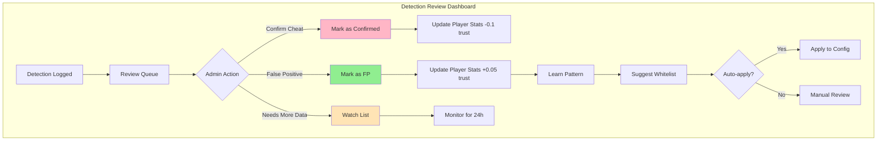
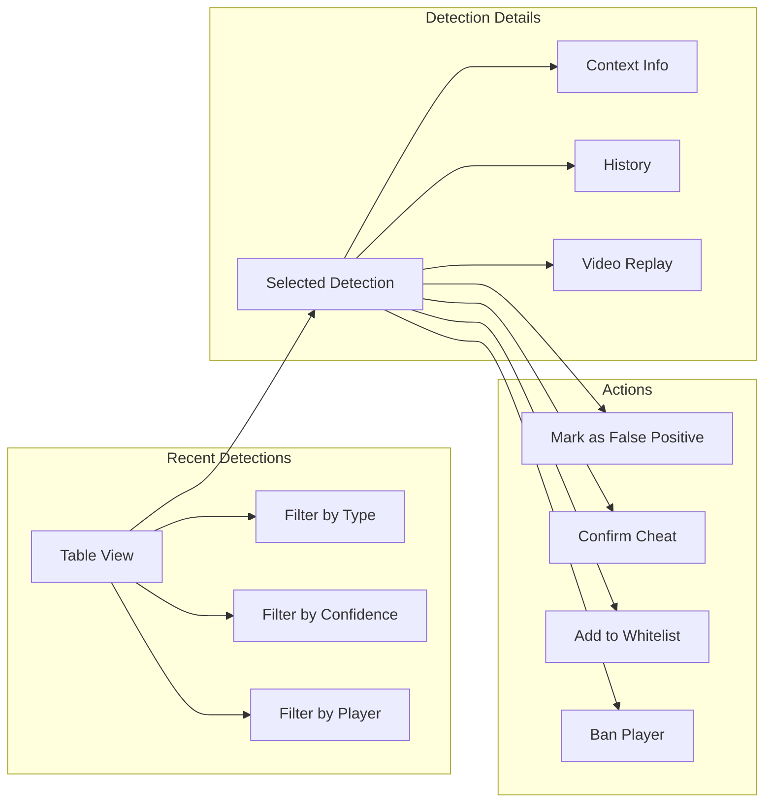
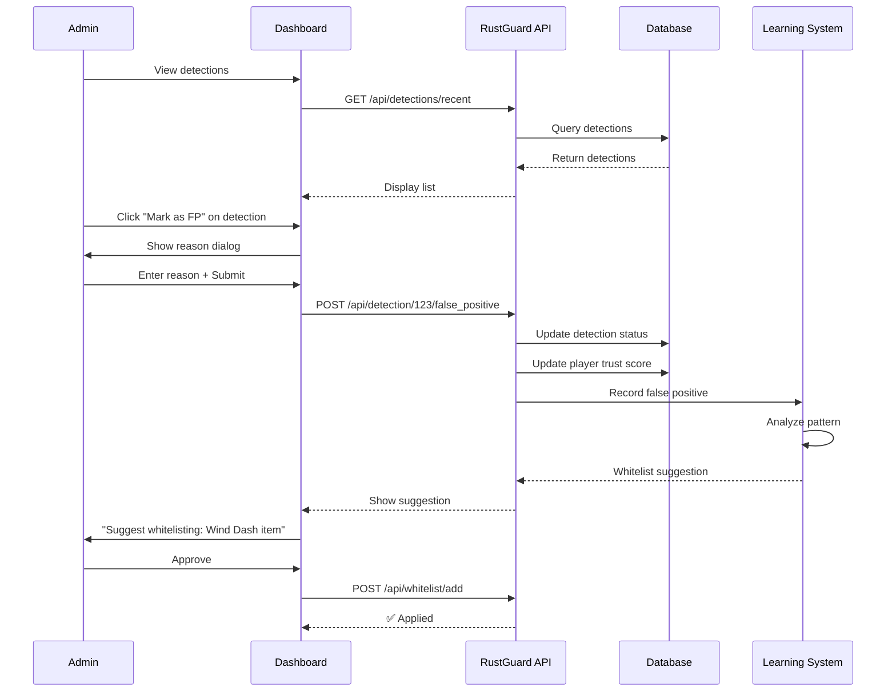
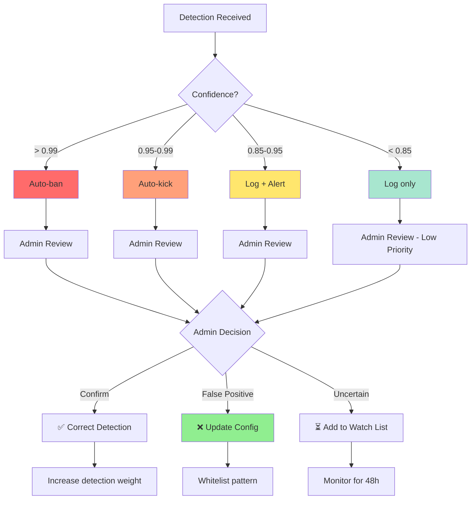

# Preventing False Positives

## Overview

False positives are the **#1 killer** of anti-cheat systems. A single false kick can:
- Ruin player experience
- Damage server reputation
- Cause players to leave
- Generate bad reviews

**Our goal:** <0.1% false positive rate

---

## Common False Positive Scenarios

### 1. Server Lag

**Problem:**
```
Player moves normally → Server lag → Packets arrive late → 
Looks like teleportation → FALSE POSITIVE
```

**Solution:**
```rust
pub struct LagDetector {
    last_keepalive: Instant,
    acceptable_delay: Duration,
}

impl LagDetector {
    pub fn is_lagging(&self, player: &PlayerState) -> bool {
        let delay = Instant::now() - player.last_keepalive;
        delay > self.acceptable_delay
    }
}

// In detection
if lag_detector.is_lagging(player) {
    tracing::debug!("Ignoring detection due to lag");
    return None; // Don't flag
}
```

**Config:**
```yaml
lag_protection:
  enabled: true
  max_keepalive_delay: 2000  # ms
  ignore_violations_during_lag: true
```

---

### 2. Custom Server Items

**Problem:**
```
Player uses MythicMobs item "Lightning Boots" → 
Grants Speed 30 → Anti-cheat sees speed 30 → 
FALSE POSITIVE
```

**Solution: Item Whitelist**
```rust
pub struct ItemWhitelist {
    allowed_items: HashMap<String, ItemEffect>,
}

#[derive(Debug)]
pub struct ItemEffect {
    pub name: String,
    pub max_speed: f64,
    pub max_jump: f64,
    pub duration: Option<Duration>,
}

impl ItemWhitelist {
    pub fn check(&self, player: &PlayerState, speed: f64) -> bool {
        for item in &player.inventory {
            if let Some(effect) = self.allowed_items.get(&item.id) {
                if speed <= effect.max_speed {
                    return true; // Whitelisted
                }
            }
        }
        false
    }
}
```

**Config:**
```yaml
whitelist:
  custom_items:
    - id: "mythicmobs:lightning_boots"
      name: "Lightning Boots"
      max_speed: 30.0
      duration: 5  # seconds
      
    - id: "mmoitems:wind_dash"
      name: "Wind Dash"
      max_speed: 50.0
      duration: 1
      teleport: true  # Allow instant position change
      
    - id: "skillapi:blink"
      name: "Blink"
      teleport: true
      max_distance: 10.0
```

---

### 3. Safe Zones (Parkour, Spawn, etc.)

**Problem:**
```
Player in parkour area → Has fly enabled for parkour → 
Anti-cheat detects flying → FALSE POSITIVE
```

**Solution: Zone System**
```rust
pub struct SafeZone {
    pub name: String,
    pub world: String,
    pub bounds: BoundingBox,
    pub allow_fly: bool,
    pub allow_speed: bool,
    pub ignore_all: bool,
}

#[derive(Debug)]
pub struct BoundingBox {
    pub x1: f64, pub y1: f64, pub z1: f64,
    pub x2: f64, pub y2: f64, pub z2: f64,
}

impl BoundingBox {
    pub fn contains(&self, pos: &Position) -> bool {
        pos.x >= self.x1 && pos.x <= self.x2 &&
        pos.y >= self.y1 && pos.y <= self.y2 &&
        pos.z >= self.z1 && pos.z <= self.z2
    }
}

impl SafeZoneManager {
    pub fn is_in_safe_zone(&self, pos: &Position, cheat_type: &str) -> bool {
        for zone in &self.zones {
            if !zone.bounds.contains(pos) {
                continue;
            }
            
            if zone.ignore_all {
                return true;
            }
            
            match cheat_type {
                "fly_hack" if zone.allow_fly => return true,
                "speed_hack" if zone.allow_speed => return true,
                _ => {}
            }
        }
        false
    }
}
```

**Config:**
```yaml
safe_zones:
  - name: "spawn_parkour"
    world: "world"
    bounds:
      x1: 0
      y1: 60
      z1: 0
      x2: 100
      y2: 100
      z2: 100
    allow_fly: true
    allow_speed: true
    
  - name: "testing_area"
    world: "world"
    bounds:
      x1: -500
      y1: 0
      z1: -500
      x2: -400
      y2: 256
      z2: -400
    ignore_all: true  # Ignore ALL detections
```

---

### 4. Potion Effects

**Problem:**
```
Player has Speed II + Jump Boost III → Moves fast and jumps high →
Anti-cheat doesn't account for amplifier → FALSE POSITIVE
```

**Solution: Effect Tracking**
```rust
pub struct EffectTracker {
    potion_multipliers: HashMap<String, Vec<f64>>, // amplifier → multiplier
}

impl EffectTracker {
    pub fn calculate_max_speed(&self, player: &PlayerState) -> f64 {
        let mut max = BASE_SPEED;
        
        // Check active effects
        if let Some(speed) = player.active_effects.get("speed") {
            if let Some(multipliers) = self.potion_multipliers.get("speed") {
                if let Some(&mult) = multipliers.get(speed.amplifier as usize) {
                    max *= mult;
                }
            }
        }
        
        max
    }
}
```

**Config:**
```yaml
potion_effects:
  speed:
    amplifiers:
      0: 1.2   # Speed I (20% faster)
      1: 1.4   # Speed II (40% faster)
      2: 1.6   # Speed III (60% faster) - custom
      
  jump_boost:
    amplifiers:
      0: 1.5   # Jump Boost I
      1: 2.0   # Jump Boost II
      2: 2.5   # Jump Boost III
```

---

### 5. Elytra Flying

**Problem:**
```
Player gliding with elytra → Moving at high speed →
Looks like speed hack → FALSE POSITIVE
```

**Solution: Equipment Detection**
```rust
impl PlayerState {
    pub fn is_using_elytra(&self) -> bool {
        self.equipment.chestplate == Some("minecraft:elytra") &&
        self.is_gliding
    }
}

// In speed detector
if player.is_using_elytra() {
    // Elytra has different speed limits
    max_speed = 50.0; // Much higher
}
```

---

### 6. Vehicle Movement

**Problem:**
```
Player in minecart/boat → Vehicle moves fast →
Detected as speed hack → FALSE POSITIVE
```

**Solution: Vehicle Detection**
```rust
impl SpeedDetector {
    pub fn check(&self, player: &PlayerState, pos: &Position) -> Option<Detection> {
        // Ignore if in vehicle
        if player.vehicle.is_some() {
            tracing::debug!("Player in vehicle, ignoring speed");
            return None;
        }
        
        // ... rest of detection
    }
}
```

---

### 7. Teleportation (Commands, Abilities)

**Problem:**
```
Player uses /tp or ability that teleports →
Instant position change → Looks like fly hack → FALSE POSITIVE
```

**Solution: Teleport Detection**
```rust
impl PlayerState {
    pub fn update_position(&mut self, pos: Position) {
        if let Some(prev) = self.positions.back() {
            let distance = pos.distance(prev);
            let time_diff = (pos.timestamp - prev.timestamp).as_secs_f64();
            
            // Detect instant teleport (>100 blocks in <0.1s)
            if distance > 100.0 && time_diff < 0.1 {
                self.last_teleport = Instant::now();
                tracing::debug!("Teleport detected");
            }
        }
        
        self.positions.push_back(pos);
    }
    
    pub fn recently_teleported(&self) -> bool {
        Instant::now() - self.last_teleport < Duration::from_secs(2)
    }
}

// In detector
if player.recently_teleported() {
    return None; // Ignore detections for 2s after teleport
}
```

---

### 8. Soul Speed Enchantment

**Problem:**
```
Player with Soul Speed boots on soul sand →
Moves faster than normal → FALSE POSITIVE
```

**Solution: Block Detection**
```rust
impl EnvironmentDetector {
    pub fn get_block_below(&self, pos: &Position) -> Block {
        // Check block at Y-1
        self.world.get_block(pos.x as i32, pos.y as i32 - 1, pos.z as i32)
    }
}

// In speed calculation
let block_below = env.get_block_below(&player.position);
if block_below == Block::SoulSand && player.has_soul_speed() {
    max_speed *= 1.5; // Account for soul speed
}
```

---

## Learning Mode

**Purpose:** Observe server patterns before enforcing

```rust
pub struct LearningMode {
    enabled: bool,
    started_at: Instant,
    duration: Duration,
    observations: Vec<Observation>,
}

#[derive(Debug)]
pub struct Observation {
    pub player: String,
    pub cheat_type: String,
    pub value: f64,
    pub context: String,
    pub timestamp: Instant,
}

impl LearningMode {
    pub fn should_kick(&self) -> bool {
        if !self.enabled {
            return true; // Normal mode
        }
        
        // Don't kick during learning period
        Instant::now() - self.started_at > self.duration
    }
    
    pub fn record(&mut self, obs: Observation) {
        self.observations.push(obs);
        
        tracing::info!(
            "Learning: {} - {} = {} ({})",
            obs.player,
            obs.cheat_type,
            obs.value,
            obs.context
        );
    }
    
    pub fn generate_whitelist(&self) -> Whitelist {
        // Analyze observations and generate suggested whitelist
        let mut whitelist = Whitelist::default();
        
        // Group by cheat type
        for obs in &self.observations {
            match obs.cheat_type.as_str() {
                "speed_hack" => {
                    if obs.value > 20.0 {
                        // Probably a custom item
                        whitelist.suggest_item(obs);
                    }
                }
                _ => {}
            }
        }
        
        whitelist
    }
}
```

**Config:**
```yaml
learning_mode:
  enabled: true
  duration_days: 7
  
  actions:
    kick: false        # Don't kick during learning
    ban: false         # Don't ban during learning
    log: true          # Log everything
    alert_discord: false  # Don't spam Discord
    
  auto_whitelist:
    enabled: true
    min_occurrences: 5  # Need 5+ observations to whitelist
```

**Usage:**
```bash
# Start server with learning mode
rustguard --learning-mode

# After 7 days
rustguard --export-observations > observations.json
rustguard --generate-whitelist observations.json > whitelist.yaml

# Review and apply
nano whitelist.yaml
cp whitelist.yaml config/whitelist.yaml
rustguard  # Normal mode with whitelist
```

---

## Progressive Trust System

**Concept:** Give trusted players benefit of doubt

```rust
pub struct TrustScoreCalculator {
    base_score: f64,
    playtime_bonus: f64,
    detection_penalty: f64,
    false_positive_bonus: f64,
}

impl TrustScoreCalculator {
    pub fn calculate(&self, player: &PlayerStats) -> f64 {
        let mut score = self.base_score; // 0.5
        
        // Playtime increases trust
        let hours = player.total_playtime_seconds as f64 / 3600.0;
        score += hours * self.playtime_bonus; // +0.01 per hour
        
        // Detections decrease trust
        score -= player.total_detections as f64 * self.detection_penalty; // -0.1 each
        
        // False positives increase trust (we wrongly flagged them)
        score += player.false_positive_count as f64 * self.false_positive_bonus; // +0.05 each
        
        score.clamp(0.0, 1.0)
    }
}

// In decision making
pub fn should_kick(&self, detection: &Detection, player: &PlayerState) -> bool {
    let confidence = detection.confidence;
    
    // High trust = need higher confidence to kick
    let threshold = if player.trust_score > 0.8 {
        0.98 // Very high threshold for trusted players
    } else if player.trust_score > 0.5 {
        0.95 // Normal threshold
    } else {
        0.90 // Lower threshold for suspicious players
    };
    
    confidence >= threshold
}
```

---

## Admin Override System

```rust
pub struct AdminOverride {
    whitelisted_players: HashSet<String>,
    override_zones: Vec<OverrideZone>,
}

impl AdminOverride {
    pub fn should_ignore(&self, player: &str, detection: &Detection) -> bool {
        // Never flag whitelisted players
        if self.whitelisted_players.contains(player) {
            tracing::debug!("Player {} is whitelisted", player);
            return true;
        }
        
        false
    }
}
```

**Config:**
```yaml
admin_overrides:
  whitelisted_players:
    - "Admin"
    - "Moderator"
    - "TestPlayer"
    
  immune_to:
    - player: "EventOrganizer"
      detections: ["speed_hack", "fly_hack"]
      reason: "Needs for event management"
```

---

## False Positive Reporting

**Allow admins to mark false positives:**

```rust
// HTTP API endpoint
POST /api/detection/{id}/false_positive

pub async fn mark_false_positive(
    detection_id: i64,
    admin: String,
    reason: String,
) -> Result<()> {
    // Update detection in database
    sqlx::query!(
        "UPDATE detections 
         SET review_status = 'false_positive',
             reviewed_by = ?,
             review_notes = ?
         WHERE id = ?",
        admin,
        reason,
        detection_id
    )
    .execute(&pool)
    .await?;
    
    // Update player stats
    sqlx::query!(
        "UPDATE player_stats 
         SET false_positive_count = false_positive_count + 1,
             trust_score = trust_score + 0.05
         WHERE player_id = (
             SELECT player_id FROM detections WHERE id = ?
         )",
        detection_id
    )
    .execute(&pool)
    .await?;
    
    // Learn from it
    learning_system.record_false_positive(detection_id).await?;
    
    Ok(())
}
```

**Dashboard Flow:**



**Dashboard UI Mockup:**



**Interaction Flow:**



**ASCII Dashboard Example:**
```
╔══════════════════════════════════════════════════════════════════╗
║                    RUSTGUARD - DETECTION REVIEW                  ║
╠══════════════════════════════════════════════════════════════════╣
║                                                                  ║
║  📊 Summary (Last 24h)                                          ║
║  ├─ Total Detections: 47                                        ║
║  ├─ Confirmed Cheats: 12  (✅ 25%)                             ║
║  ├─ False Positives: 3   (⚠️ 6.4%)                             ║
║  └─ Pending Review: 32   (⏳ 68%)                              ║
║                                                                  ║
╠══════════════════════════════════════════════════════════════════╣
║  🔍 Recent Detections                    [Filter ▼] [Refresh]   ║
╠══════════════════════════════════════════════════════════════════╣
║                                                                  ║
║  ┌────────────┬──────────┬──────┬────────┬────────┬──────────┐ ║
║  │ Player     │ Type     │ Conf │ Action │ Status │ Actions  │ ║
║  ├────────────┼──────────┼──────┼────────┼────────┼──────────┤ ║
║  │ xXHackerXx │ Speed    │ 0.98 │ Kick   │ ⏳     │ [Review] │ ║
║  │ LegitPlay  │ Fly      │ 0.92 │ Log    │ ⏳     │ [Review] │ ║
║  │ Cheater123 │ KillAura │ 0.99 │ Ban    │ ✅     │ [View]   │ ║
║  │ NoobPlayer │ Speed    │ 0.87 │ Log    │ ⚠️ FP  │ [View]   │ ║
║  └────────────┴──────────┴──────┴────────┴────────┴──────────┘ ║
║                                                                  ║
║  ← Prev [1] [2] [3] ... [10] Next →                            ║
║                                                                  ║
╠══════════════════════════════════════════════════════════════════╣
║  📋 Detection Details: LegitPlay - Fly Hack                     ║
╠══════════════════════════════════════════════════════════════════╣
║                                                                  ║
║  📅 Timestamp: 2025-10-26 21:45:32                              ║
║  🎯 Confidence: 0.92 (High)                                     ║
║  📍 Location: (234, 78, -891) in "world"                        ║
║                                                                  ║
║  📊 Context:                                                    ║
║  ├─ Effects: None                                               ║
║  ├─ Items: [Diamond Sword, Golden Apple x3, ...]               ║
║  ├─ Zone: "spawn_area"  ⚠️ (Not a safe zone)                   ║
║  ├─ Trust Score: 0.65 (Normal)                                  ║
║  └─ Previous Violations: 0                                      ║
║                                                                  ║
║  💬 Detection Reason:                                           ║
║  "Player ascending without jumping (Y +3.5 in 0.5s)"            ║
║                                                                  ║
║  🤔 Possible Explanations:                                      ║
║  • Custom item granting flight                                  ║
║  • Server plugin ability                                        ║
║  • Lag causing false detection                                  ║
║                                                                  ║
║  ⚡ Quick Actions:                                              ║
║  [✅ Confirm Cheat]  [❌ Mark False Positive]  [👁️ Watch]     ║
║                                                                  ║
╠══════════════════════════════════════════════════════════════════╣
║  💡 AI Suggestion:                                              ║
║  "This might be a false positive. Player has no history and     ║
║   was in spawn area. Consider adding spawn to safe zones."      ║
║                                                                  ║
║  [🔧 Auto-fix: Add spawn to safe zones]                        ║
╚══════════════════════════════════════════════════════════════════╝
```

**Decision Tree Diagram:**



---

## Automatic Pattern Learning

```rust
pub struct PatternLearner {
    patterns: Vec<LearnedPattern>,
}

#[derive(Debug)]
pub struct LearnedPattern {
    pub description: String,
    pub occurrences: u32,
    pub avg_value: f64,
    pub context: String,
    pub suggested_whitelist: Option<WhitelistEntry>,
}

impl PatternLearner {
    pub async fn analyze(&mut self) {
        // Group similar detections
        let groups = self.group_by_similarity();
        
        for group in groups {
            if group.len() >= 5 {
                // 5+ similar detections
                tracing::info!(
                    "Pattern detected: {} occurrences of {}",
                    group.len(),
                    group[0].cheat_type
                );
                
                // Suggest whitelist
                if let Some(suggestion) = self.suggest_whitelist(&group) {
                    self.patterns.push(LearnedPattern {
                        description: format!(
                            "Speed {} in context {}",
                            suggestion.max_value,
                            suggestion.context
                        ),
                        occurrences: group.len() as u32,
                        avg_value: suggestion.max_value,
                        context: suggestion.context.clone(),
                        suggested_whitelist: Some(suggestion),
                    });
                }
            }
        }
    }
}
```

---

## Testing for False Positives

```rust
#[tokio::test]
async fn test_no_false_positive_with_speed_potion() {
    let detector = SpeedDetector::new(config);
    let mut player = PlayerState::new("TestPlayer");
    
    // Add Speed II effect
    player.active_effects.insert(
        "speed".to_string(),
        PotionEffect { amplifier: 1, duration: 180 }
    );
    
    // Move at speed II speeds (should be OK)
    let pos1 = Position { x: 0.0, y: 64.0, z: 0.0 };
    let pos2 = Position { x: 7.5, y: 64.0, z: 0.0 }; // 7.5 b/s
    
    let result = detector.check(&player, &pos2).await;
    assert!(result.is_none(), "Should not flag Speed II as hack");
}

#[tokio::test]
async fn test_no_false_positive_in_safe_zone() {
    let engine = DetectionEngine::new(config);
    let mut player = PlayerState::new("TestPlayer");
    
    // Player in parkour zone
    player.position = Position { x: 50.0, y: 70.0, z: 50.0 };
    
    // Flying (allowed in parkour)
    let fly_packet = create_fly_packet();
    
    let detections = engine.analyze(&fly_packet, &mut player).await;
    assert!(detections.is_empty(), "Should not flag flying in parkour");
}
```

---

## Monitoring False Positive Rate

```rust
pub struct FalsePositiveMetrics {
    total_detections: AtomicU64,
    false_positives: AtomicU64,
}

impl FalsePositiveMetrics {
    pub fn rate(&self) -> f64 {
        let total = self.total_detections.load(Ordering::Relaxed);
        let fp = self.false_positives.load(Ordering::Relaxed);
        
        if total == 0 {
            return 0.0;
        }
        
        (fp as f64 / total as f64) * 100.0
    }
    
    pub fn alert_if_high(&self) {
        let rate = self.rate();
        
        if rate > 1.0 {
            tracing::warn!(
                "False positive rate is {:.2}%! Review configuration",
                rate
            );
            
            // Alert admins
            send_discord_alert(format!(
                "⚠️ High false positive rate: {:.2}%",
                rate
            ));
        }
    }
}
```

---

## Best Practices Checklist

✅ **Always test with:**
- Vanilla gameplay
- Common potion effects
- Custom server items
- Parkour/creative zones
- Elytra flight
- Vehicles
- Lag scenarios

✅ **Start with learning mode** for at least 1 week

✅ **Monitor false positive rate** daily

✅ **Allow admin overrides** for false positives

✅ **Use progressive trust** - don't immediately ban

✅ **Whitelist custom content** before going live

✅ **Log everything** - review logs regularly

✅ **Have an appeal process** for false bans

---

## Configuration Example

```yaml
false_positive_prevention:
  # Learning mode
  learning_mode:
    enabled: true
    duration_days: 7
    
  # Lag protection
  lag_protection:
    enabled: true
    max_acceptable_delay: 2000
    ignore_during_lag: true
    
  # Trust system
  trust_system:
    enabled: true
    base_score: 0.5
    playtime_bonus: 0.01  # per hour
    detection_penalty: 0.1
    false_positive_bonus: 0.05
    
    # Thresholds by trust level
    kick_threshold:
      low_trust: 0.90    # <0.3 trust
      normal: 0.95       # 0.3-0.8 trust
      high_trust: 0.98   # >0.8 trust
  
  # Grace periods
  grace_periods:
    after_join: 10       # seconds
    after_teleport: 2    # seconds
    after_respawn: 5     # seconds
    
  # Monitoring
  monitoring:
    alert_on_fp_rate: 1.0  # Alert if >1% FP rate
    review_detections_above: 0.90  # Manual review needed
```

---

## Related Documents
- [[Speed-Hack]]
- [[Fly-Hack]]
- [[KillAura]]
- [[XRay]]
