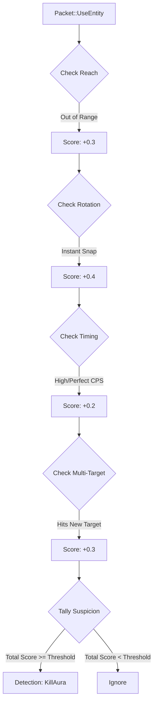

# KillAura Detection

## Overview

KillAura is one of the most common and difficult cheats to detect. It allows a player to automatically attack entities within a certain range with inhuman precision and attack rate (CPS). RustGuard's KillAura detector uses a **multi-indicator scoring system** instead of relying on a single metric.

## Key Indicators

The detection engine accumulates suspicion points based on four main indicators per attack packet (`Packet::UseEntity`).

|Indicator|Detection Principle|Affected Confidence|
|---|---|---|
|**Extended Reach**|Distance between player and target exceeds server max limit (e.g., 3.0 or 4.5 blocks).|High|
|**Impossible Rotation**|Head rotation change (Yaw/Pitch) between ticks is too large (e.g., > $180^\circ$).|Very High|
|**Inhuman Timing**|Attack rate (CPS) is constant and/or exceeds human limits (e.g., > 18 CPS).|Medium|
|**Multi-Targeting**|Hits multiple entities on consecutive ticks with perfect alternation.|Very High|

## Detector Flow Diagram



## Implementation Logic (Multi-Check)

Detection triggers with high confidence only if at least two suspicious indicators occur simultaneously (`min_suspicious_indicators` in config).

```rust
impl KillAuraDetector {
    async fn check(&self, player: &PlayerState, attack: &AttackData) -> Option<Detection> {
        player.attack_history.push_back(attack.clone());
        
        let mut suspicious_count = 0;
        let mut total_score = 0.0;

        // Indicator 1: Extended Reach (3.0 blocks + tolerance)
        if attack.distance > self.config.max_reach + 0.1 {
            suspicious_count += 1;
            total_score += 0.3;
        }

        // Indicator 2: Impossible Rotation (Snap)
        if self.has_instant_rotation(player) {
            suspicious_count += 1;
            total_score += 0.4;
        }
        
        // Indicator 3: Inhuman Timing (e.g., 20 ticks of 50ms intervals)
        if self.has_perfect_timing(player) {
            suspicious_count += 1;
            total_score += 0.2;
        }

        // Final decision based on count
        if suspicious_count < self.config.min_suspicious_indicators {
            return None; // Not enough evidence
        }
        
        let confidence = total_score.min(1.0);

        Some(Detection {
            cheat_type: "killaura".to_string(),
            confidence,
            details: json!({
                "suspicious_indicators": suspicious_count,
                "reach": attack.distance,
            }),
            timestamp: Utc::now().timestamp(),
        })
    }
}
```

## False Positive Mitigation

1. **Server Lag:** If packet delays are high, rotation deltas may appear large. Apply tolerance for low `packet_frequency` players.
    
2. **Pointer Context:** Normal pointer movement history is required. Perfect constant rotations are suspicious; small human micro-corrections indicate fair play.
    

## Related Documents

[[Detection-Engine]] 
[[Context-System]] 
[[Configuration]] 