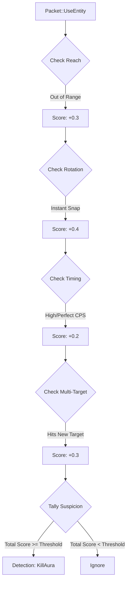

# Detección de KillAura

## Descripción General

KillAura (o Aura de Muerte) es una de las trampas más comunes y difíciles de detectar. Consiste en atacar automáticamente a entidades dentro de un rango determinado, a menudo con una precisión y una cadencia (CPS) imposibles para un jugador humano. El detector de KillAura de RustGuard utiliza un sistema de **puntuación de múltiples indicadores** en lugar de depender de una única métrica.

## Indicadores Clave

El motor de detección acumula puntos de sospecha basándose en cuatro indicadores principales por cada paquete de ataque (`Packet::UseEntity`).

|Indicador|Principio de Detección|Confianza Afectada|
|---|---|---|
|**Reach Extendido**|La distancia entre el jugador y el objetivo excede el límite máximo del servidor (ej. 3.0 o 4.5 bloques).|Alta|
|**Rotación Imposible**|El cambio de ángulo de la cabeza (Yaw/Pitch) entre ticks es demasiado grande (ej. > $180^\circ$).|Muy Alta|
|**Inhuman Timing**|La cadencia de ataque (CPS) es constante y/o excede el límite físico humano (ej. > 18 CPS).|Media|
|**Multi-Targeting**|Atacar a múltiples entidades en ticks consecutivos con una alternancia perfecta.|Muy Alta|

## Diagrama de Flujo del Detector




## Lógica de Implementación (Multi-Check)

La detección solo se lanza con alta confianza si se cumplen al menos dos indicadores sospechosos simultáneamente, según lo definido en la configuración (`min_suspicious_indicators`).

```rust
impl KillAuraDetector {
    // La función principal verifica la puntuación de sospecha
    async fn check(&self, player: &PlayerState, attack: &AttackData) -> Option<Detection> {
        player.attack_history.push_back(attack.clone());
        
        // 1. Recopilar indicadores
        let mut suspicious_count = 0;
        let mut total_score = 0.0;

        // Indicador 1: Reach Extendido (3.0 bloques + tolerancia)
        if attack.distance > self.config.max_reach + 0.1 {
            suspicious_count += 1;
            total_score += 0.3;
        }

        // Indicador 2: Rotación Imposible (Snap)
        if self.has_instant_rotation(player) {
            suspicious_count += 1;
            total_score += 0.4;
        }
        
        // Indicador 3: Inhuman Timing (Ej: 20 ticks seguidos de 50ms exactos)
        if self.has_perfect_timing(player) {
            suspicious_count += 1;
            total_score += 0.2;
        }

        // 2. Decisión final basada en el conteo
        if suspicious_count < self.config.min_suspicious_indicators {
            return None; // No suficiente evidencia
        }
        
        // La confianza se calcula a partir de la puntuación acumulada y el número de indicadores
        let confidence = total_score.min(1.0); 

        Some(Detection {
            cheat_type: "killaura".to_string(),
            confidence,
            details: json!({
                "suspicious_indicators": suspicious_count,
                "reach": attack.distance,
            }),
            timestamp: Utc::now().timestamp(),
        })
    }
}
```


## Mitigación de Falsos Positivos

La mayor mitigación es el requisito de múltiples indicadores. Además, el detector debe:

1. **Ignorar el lag del servidor:** Si el tiempo entre paquetes es alto, los deltas de rotación pueden ser grandes. Se debe aplicar una tolerancia si el `packet_frequency` del jugador es bajo.
    
2. **Contexto del Puntero:** Se requiere un historial de movimiento normal del puntero. Una rotación perfecta y constante es sospechosa; las microcorrecciones humanas son una señal de juego limpio.
    

## Documentos Relacionados

[[Detection-Engine]] [[Context-System]] [[Configuration]]