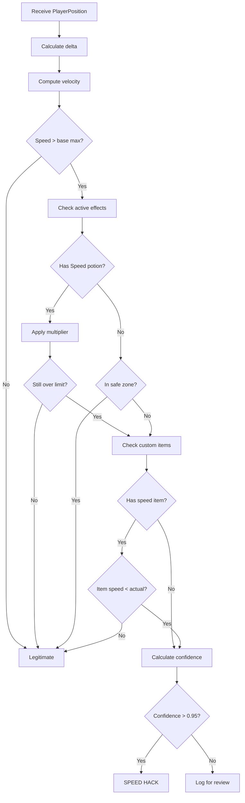

# Speed Hack Detection

## Overview

Speed hacks modify player movement speed beyond normal game limits. Detection requires analyzing position changes over time while accounting for legitimate speed modifiers.

## Detection Algorithm


## Implementation

### Core Detection
```rust
pub struct SpeedDetector {
    max_base_speed: f64,
    sprint_multiplier: f64,
    confidence_threshold: f64,
}

impl SpeedDetector {
    pub fn analyze(&self, player: &PlayerState, pos: &Position) -> DetectionResult {
        // Calculate velocity
        let delta_time = pos.timestamp - player.last_pos.timestamp;
        let distance = pos.distance(&player.last_pos);
        let speed = distance / delta_time.as_secs_f64();
        
        // Base check
        let mut max_allowed = self.max_base_speed;
        
        // Apply modifiers
        if player.is_sprinting {
            max_allowed *= self.sprint_multiplier;
        }
        
        if let Some(speed_effect) = player.effects.get("speed") {
            max_allowed *= self.potion_multiplier(speed_effect.amplifier);
        }
        
        // Environment factors
        if player.on_ice {
            max_allowed *= 2.5;
        }
        
        if player.in_water {
            max_allowed *= 0.3;
        }
        
        // Check against limit
        if speed <= max_allowed {
            return DetectionResult::Clean;
        }
        
        // Context check
        if self.has_valid_reason(player, speed) {
            return DetectionResult::Clean;
        }
        
        // Calculate confidence
        let overspeed_ratio = speed / max_allowed;
        let confidence = self.calculate_confidence(overspeed_ratio, player);
        
        DetectionResult::Suspicious {
            cheat_type: "speed_hack",
            confidence,
            details: format!("Speed: {:.2} (max: {:.2})", speed, max_allowed),
        }
    }
    
    fn calculate_confidence(&self, ratio: f64, player: &PlayerState) -> f64 {
        // More extreme = higher confidence
        let base_confidence = (ratio - 1.0).min(1.0);
        
        // Adjust for player history
        let trust_penalty = (1.0 - player.trust_score) * 0.2;
        
        // Consistent violation increases confidence
        let pattern_bonus = if player.recent_speed_violations > 3 {
            0.2
        } else {
            0.0
        };
        
        (base_confidence + trust_penalty + pattern_bonus).min(1.0)
    }
}
```

### Maximum Speeds

| Condition | Speed (blocks/s) |
|-----------|------------------|
| Walking | 4.3 |
| Sprinting | 5.6 |
| Speed I | 6.7 |
| Speed II | 7.8 |
| Speed I + Sprint | 8.7 |
| Speed II + Sprint | 10.1 |
| On ice | x2.5 |
| In water | x0.3 |
| Soul Speed (soul sand) | +varying |

### Context Checks
```rust
fn has_valid_reason(&self, player: &PlayerState, speed: f64) -> bool {
    // Check whitelisted effects
    for effect in &player.active_effects {
        if let Some(max_speed) = self.whitelist.get(&effect.name) {
            if speed <= *max_speed {
                return true;
            }
        }
    }
    
    // Check safe zones
    if self.is_in_safe_zone(&player.position) {
        return true;
    }
    
    // Check custom items
    for item in &player.inventory {
        if let Some(grants) = item.custom_data.get("grants_speed") {
            if speed <= grants.as_f64().unwrap() {
                return true;
            }
        }
    }
    
    false
}
```

## Configuration
```yaml
detection:
  speed_hack:
    enabled: true
    
    # Base limits
    max_base_speed: 4.3
    max_sprint_speed: 5.6
    
    # Multipliers
    sprint_multiplier: 1.3
    potion_multipliers:
      1: 1.2  # Speed I
      2: 1.4  # Speed II
      3: 1.6  # Speed III (custom)
    
    # Environment
    ice_multiplier: 2.5
    water_multiplier: 0.3
    
    # Thresholds
    confidence_threshold: 0.95
    min_violations: 3  # Require consistent pattern
    
    # Whitelist
    allowed_effects:
      - name: "mythicmobs:lightning_boots"
        max_speed: 30.0
      - name: "mmoitems:wind_dash"
        max_speed: 50.0
        duration: 1  # seconds
```

## Edge Cases

### Lag Compensation
```rust
// Don't flag if player is lagging
if player.last_keepalive_delay > Duration::from_secs(2) {
    return DetectionResult::Clean; // Likely lag spike
}
```

### Teleportation
```rust
// Detect teleports (instant position change)
let distance = pos.distance(&player.last_pos);
if distance > 100.0 && delta_time < 0.1 {
    // Likely teleport, not speed hack
    player.last_teleport = Instant::now();
    return DetectionResult::Clean;
}
```

### Vehicle Movement
```rust
// Ignore if in vehicle (boat, minecart, horse)
if player.vehicle.is_some() {
    return DetectionResult::Clean;
}
```

## Testing

### Unit Test
```rust
#[test]
fn test_speed_detection() {
    let detector = SpeedDetector::new(config);
    let mut player = PlayerState::new("TestPlayer");
    
    // Normal movement
    player.last_pos = Position { x: 0.0, y: 64.0, z: 0.0, t: 0 };
    let current = Position { x: 4.0, y: 64.0, z: 0.0, t: 1000 }; // 4 b/s
    
    let result = detector.analyze(&player, &current);
    assert!(matches!(result, DetectionResult::Clean));
    
    // Speed hack
    let hacked = Position { x: 50.0, y: 64.0, z: 0.0, t: 1000 }; // 50 b/s
    let result = detector.analyze(&player, &hacked);
    assert!(matches!(result, DetectionResult::Suspicious { .. }));
}
```

### Integration Test
```rust
#[tokio::test]
async fn test_speed_hack_with_action() {
    let proxy = setup_test_proxy().await;
    
    // Simulate speed hack packets
    for i in 0..10 {
        send_position_packet(i * 10.0, 64.0, 0.0).await;
        tokio::time::sleep(Duration::from_millis(100)).await;
    }
    
    // Verify kick happened
    assert!(player_was_kicked().await);
    
    // Verify database log
    let detection = query_latest_detection().await;
    assert_eq!(detection.cheat_type, "speed_hack");
}
```

## False Positive Prevention

### Learning Mode
```rust
// First week: observe only, don't kick
if server_age < Duration::from_days(7) {
    if speed > max_allowed {
        log_observation(player, speed);
        // Auto-generate whitelist suggestions
    }
    return DetectionResult::Clean;
}
```

### Admin Override
```yaml
whitelist:
  players:
    - "AdminPlayer"  # Never flag
  zones:
    - name: "testing_area"
      bounds: {x1: 0, y1: 0, z1: 0, x2: 100, y2: 100, z2: 100}
      ignore_detections: true
```

## Performance

- **CPU:** <0.1ms per packet
- **Memory:** ~200 bytes per player
- **Accuracy:** >99% (with proper config)
- **False Positives:** <0.1% (with context system)

## Related Documents
- [[False-Positives]]
- [[Context-System]]
- [[Fly-Hack]]