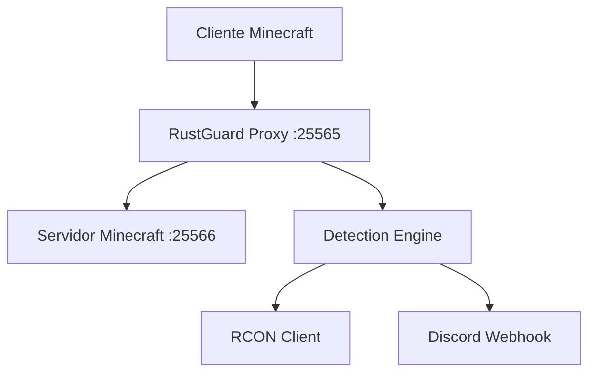

### 🧩 First-Run.md

````
# Primer Inicio

RustGuard está listo para su primera ejecución tras configurar `config.yml`. Este documento guía al usuario para iniciar el proxy, verificar su funcionamiento y validar que la conexión con Minecraft sea correcta.

## 🚀 Ejecución Inicial

```bash
cargo run --release
````

O, si ya fue compilado:

```
./target/release/rustguard
```

### ✅ Verificación

- El proxy escucha en `25565`.
- El servidor Minecraft debe estar en `localhost:25566`.
- Mensaje esperado en consola:
    

```
[INFO] RustGuard proxy iniciado en :25565
```

### 🧠 Recomendaciones

- Ejecutar en `tmux` o `screen`.
- Revisar logs en `logs/latest.log`.
- Conectar con cliente Minecraft para test de funcionalidad.

### 🌐 Flujo Inicial




---