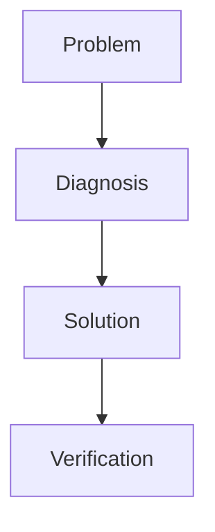

### ⚠️ Troubleshooting.md


# Troubleshooting


This document helps diagnose common issues during RustGuard execution.


## 🔌 Proxy-Server Connection


- Make sure Minecraft is running on the same port as your server.
- 
- Make sure `online-mode=false`.

- Check that the port is not in use


## 🧱 Database


- Confirm the existence of `rustguard.db`.

- Check directory permissions.

- For SQLite, ensure the file is readable.


## 🔑 RCON


- Port `25575` should be accessible and password correct.

- RCON is local only; do not expose it publicly.


## 🕸️ Webhooks


- Webhook URL must be valid.

- Discord channel must have write permissions.

- Avoid exceeding rate limits.


## 🧩 Diagnostic Examples


```rust

// Check RCON connection

let rcon = Rcon::connect("127.0.0.1:25575", "my_password")?;

rcon.cmd("say Test")?;

```


```shell

# Test local API

curl http://localhost:25565/api/status

```


### 🔄 Resolution Flow



