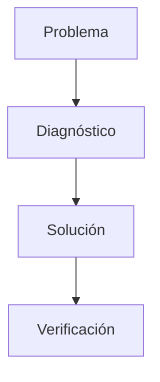

### ⚠️ Troubleshooting.md

# Solución de Problemas

Este documento ayuda a diagnosticar problemas comunes durante la ejecución de RustGuard.

## 🔌 Conexión Proxy-Servidor
- Verificar que Minecraft está en puerto `25566`.
- Asegurar `online-mode=false`.
- Comprobar que `25565` no esté ocupado.

## 🧱 Base de Datos
- Confirmar existencia de `rustguard.db`.
- Revisar permisos de directorio.
- Para SQLite, comprobar que el archivo sea legible.

## 🔑 RCON
- Puerto `25575` accesible y contraseña correcta.
- RCON solo local, no exponer al público.

## 🕸️ Webhooks
- URL del webhook válida.
- Canal de Discord con permisos de escritura.
- Evitar superar límites de tasa.

## 🧩 Ejemplos de Diagnóstico
```rust
// Chequear conexión RCON
let rcon = Rcon::connect("127.0.0.1:25575", "mi_contraseña")?;
rcon.cmd("say Test")?;
````

```shell
# Test API local
curl http://localhost:25565/api/status
```


### 🔄 Flujo de Resolución


