# Contributing Guide

## Welcome! 🎉

Thank you for considering contributing to RustGuard!

## Ways to Contribute

1. **Code** - Implement features or fix bugs
2. **Documentation** - Improve docs or examples
3. **Testing** - Write tests or report bugs
4. **Design** - UI/UX for dashboard
5. **Community** - Help others in discussions

## Getting Started

### 1. Fork & Clone
```bash
# Fork on GitHub, then:
git clone https://github.com/YOUR_USERNAME/rustguard
cd rustguard
```

### 2. Create Branch
```bash
# Feature branch
git checkout -b feature/your-feature-name

# Bugfix branch
git checkout -b fix/bug-description
```

### 3. Setup Development Environment
```bash
# Install dependencies
cargo build

# Run tests
cargo test

# Run with hot reload
cargo watch -x run
```

## Development Guidelines

### Code Style

**Use rustfmt:**
```bash
cargo fmt
```

**Use clippy:**
```bash
cargo clippy -- -D warnings
```

**Naming conventions:**
```rust
// Good
struct PlayerState { }
fn analyze_speed() { }
const MAX_SPEED: f64 = 10.8;

// Bad
struct playerState { }
fn AnalyzeSpeed() { }
const max_speed: f64 = 10.8;
```

### Commit Messages

Follow [Conventional Commits](https://www.conventionalcommits.org/):
```bash
# Features
git commit -m "feat(detection): add fly hack detector"

# Bugfixes
git commit -m "fix(proxy): handle client disconnect gracefully"

# Docs
git commit -m "docs(setup): add Docker installation guide"

# Tests
git commit -m "test(speed): add edge case tests"

# Chores
git commit -m "chore: update dependencies"
```

### Pull Request Process

1. **Update documentation** if needed
2. **Add tests** for new features
3. **Ensure all tests pass**: `cargo test`
4. **Check formatting**: `cargo fmt --check`
5. **Run clippy**: `cargo clippy`
6. **Update CHANGELOG.md**
7. **Create PR** with clear description

**PR Template:**
```markdown
## Description
Brief description of changes

## Type of Change
- [ ] Bug fix
- [ ] New feature
- [ ] Breaking change
- [ ] Documentation update

## Testing
- [ ] Unit tests added/updated
- [ ] Integration tests pass
- [ ] Manually tested

## Checklist
- [ ] Code follows style guidelines
- [ ] Self-review completed
- [ ] Documentation updated
- [ ] No new warnings
```


## Project Structure

```mermaid
sequenceDiagram
    participant C as 💻 Client
    participant P as 🛡️ Proxy
    participant PP as 📨 Parser
    participant DE as 🔍 Detector
    participant AC as ⚡ Action
    participant DB as 🗄️ Database
    participant D as 📢 Discord
    participant R as 🖥️ RCON
    participant S as 🖲️ Server

    C->>P: PlayerPosition packet
    activate P

    P->>P: Buffer packet
    P->>PP: Parse raw bytes

    activate PP
    PP->>PP: Identify packet type
    PP->>PP: Deserialize data
    PP-->>P: Parsed packet
    deactivate PP

    P->>DE: Analyze packet
    activate DE

    DE->>DE: Check speed
    DE->>DE: Check context
    DE->>DE: Calculate confidence

    alt Legitimate
        DE-->>P: OK
        P->>S: Forward packet
        S-->>C: Server response
    else Suspicious (low confidence)
        DE->>AC: Log only
        AC->>DB: Write to database
        P->>S: Forward packet
        S-->>C: Server response
    else Cheating (high confidence)
        DE->>AC: Take action
        AC->>DB: Log to database
        AC->>D: Alert Discord
        AC->>R: Execute RCON kick
        AC-->>C: Disconnect
    end

    deactivate DE
    deactivate P
```

