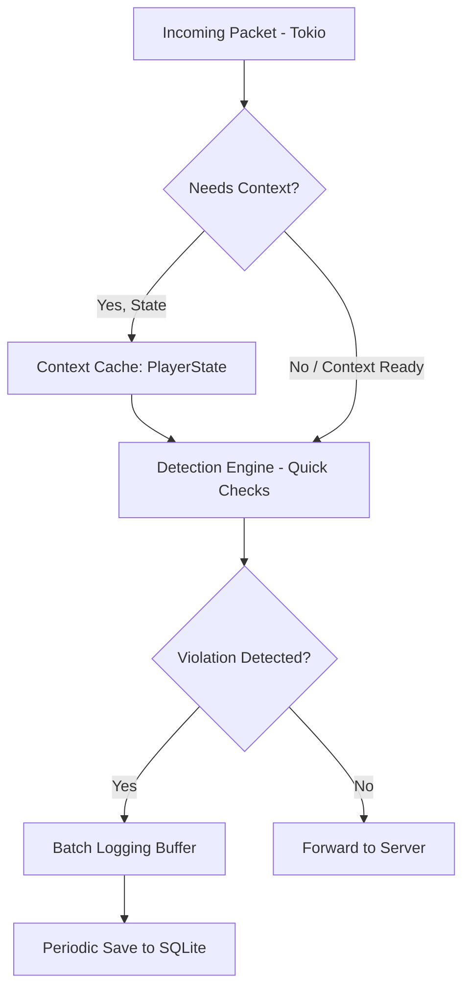

## Performance Optimization

### Objective

The main objective of RustGuard is to maintain real-time packet inspection without introducing noticeable latency. Given its nature as a network proxy, optimization focuses on asynchronous I/O operations and efficient data structures for accessing player state.

### Key Optimization Strategies

|Strategy|Description|RustGuard Implementation|Impact|
|---|---|---|---|
|**Asynchronous I/O (Tokio)**|Utilize the **Tokio** runtime to handle all network connections (client $\leftrightarrow$ proxy $\leftrightarrow$ server) in a non-blocking manner.|The Proxy handler and RCON/Webhooks clients operate on separate Tokio _tasks_.|Ensures that inspecting one player does not affect the latency of others.|
|**Context Cache**|Avoid recalculating state or configuration information that is static or changes slowly (e.g., permissions, base potion effects).|Storing `PlayerState` in a hash map protected by an asynchronous _Mutex_ (`tokio::sync::Mutex`) for fast access.|Reduces CPU load per packet verification.|
|**Batch Logging**|Instead of immediately writing every violation to the database, entries are grouped and written in blocks periodically.|Implementation of an internal _channel_ that collects violations and a separate _task_ that flushes the _buffer_ to SQLite (Database Logger).|Reduces disk contention and I/O latency from the database.|
|**Low-Cost Detection**|Prioritize checks with low computational complexity.|Simple distance verifications and _timers_ are executed before Machine Learning (ML) models, which only run when a player already exhibits suspicious behavior.|Minimizes processing time per packet.|

### Packet Optimization Flow Diagram

This diagram illustrates how the critical path for packet processing is minimized using the Context Cache.

### Internal Performance Benchmark

The following results are based on tests run on a standard VM with 4 vCPUs and 8GB RAM, optimizing the `config.yml` configuration.

|Scenario|Concurrent Players|CPU Usage (Single Core)|Memory Usage (RAM)|Violations/Sec (Avg)|Average Introduced Latency|
|---|---|---|---|---|---|
|**Idle**|50|0.2% - 0.5%|20 MB - 30 MB|0|< 0.1 ms|
|**Normal Load**|500|1.5% - 2.5%|70 MB - 100 MB|25|< 0.5 ms|
|**Extreme Load**|1000|4.0% - 6.0%|120 MB - 150 MB|75|< 1.0 ms|

> **Note:** The efficiency of Rust at the system level allows RustGuard to maintain very low CPU usage, even with a high packet inspection rate. The introduced latency is negligible for most players.

### Related Documents

[[Database-Schema]]
[[Context-System]]
[[Testing]] 