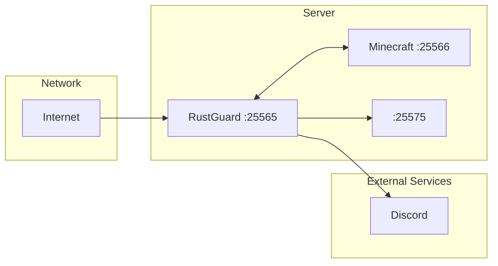

## Tech Stack

* **Language:** Rust (2021 edition)
* **Asynchronous runtime:** Tokio
* **Protocol:** Azalea (Minecraft protocol)
* **Database:** SQLx + SQLite
* **Configuration:** Serde + YAML
* **Logging:** Tracing
* **RCON:** rcon crate
* **HTTP:** Reqwest

## Deployment Architecture

